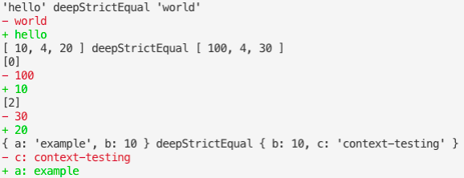

# @zoroaster/deep-equal

[](https://npmjs.org/package/@zoroaster/deep-equal)

`@zoroaster/deep-equal` is The Deep Equal Assertion With Color.

```sh
yarn add -E @zoroaster/deep-equal
```

## Table Of Contents

- [Table Of Contents](#table-of-contents)
- [API](#api)
- [`deepEqual(actual: ?, expected: ?, message?: string|!Error)`](#deepequalactual-expected-message-stringerror-void)
- [Copyright](#copyright)

<p align="center"><a href="#table-of-contents"></a></p>

## API

The package is available by importing its default function:

```js
import deepEqual from '@zoroaster/deep-equal'
```

<p align="center"><a href="#table-of-contents"></a></p>

## `deepEqual(`<br/>&nbsp;&nbsp;`actual: ?,`<br/>&nbsp;&nbsp;`expected: ?,`<br/>&nbsp;&nbsp;`message?: string|!Error,`<br/>`): void`

Calls `assert.deepStrictEqual` and then creates a visual representation of the difference between objects if it throws.

```js
import deepEqual from '@zoroaster/deep-equal'

const compare = (a, b) => {
  try {
    deepEqual(a, b)
  } catch (err) {
    console.log(err.message)
  }
}

compare('hello', 'world')
compare([10, 4, 20], [100, 4, 30])
compare({ a: 'example', b: 10 }, { b: 10, c: 'context-testing' })
```

<table>
<table>
<tr><td>

```
'hello' deepStrictEqual 'world'
- world
+ hello
[ 10, 4, 20 ] deepStrictEqual [ 100, 4, 30 ]
[0]
- 100
+ 10
[2]
- 30
+ 20
{ a: 'example', b: 10 } deepStrictEqual { b: 10, c: 'context-testing' }
- c: context-testing
+ a: example
```
</td></tr><tr><td>


</td></tr>
</table>

<p align="center"><a href="#table-of-contents"></a></p>

## Copyright


  (c) [Context Testing](https://contexttesting.com) 2019


<p align="center"><a href="#table-of-contents"></a></p>